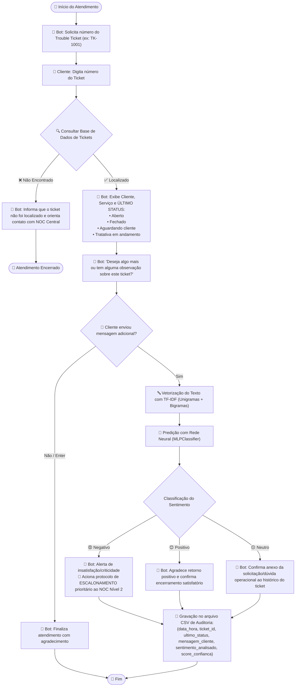

# 🤖 Chatbot de Trouble Tickets com Análise de Sentimento via Redes Neurais

[](https://www.python.org/)
[](https://scikit-learn.org/)
[](https://jupyter.org/)
[](https://educacao-executiva.fgv.br/)

Projeto prático de aplicação de **Redes Neurais (Perceptron Multicamadas - MLP)** e **Processamento de Linguagem Natural (TF-IDF)** para atendimento automatizado, consulta de **Trouble Tickets** de redes/telecom e análise de sentimento em tempo real de mensagens de clientes corporativos com persistência de auditoria em arquivo CSV.

---

## 📌 1. Contexto e Problema de Negócio

Centrais de suporte técnico e **NOC (Network Operations Center)** gerenciam diariamente centenas de incidentes críticos em infraestrutura de TI e Telecomunicações (links dedicados, sessões BGP, instabilidades de roteamento, VPNs e firewalls).

Este projeto implementa um chatbot inteligente capaz de:
1. **Identificar o chamado:** Solicita o identificador do Trouble Ticket (`TK-1001`, `TK-1002`...);
2. **Consultar o status:** Localiza o chamado em base de dados tabular e exibe o último status (**`Aberto`**, **`Fechado`**, **`Aguardando cliente`** ou **`Tratativa em andamento`**);
3. **Pergunta de continuidade:** Questiona se o cliente deseja algo mais ou tem observações adicionais;
4. **Analisar sentimentos com Rede Neural:** Caso haja mensagem adicional, processa o texto com `TF-IDF` e classifica a emoção em **`negativo`**, **`positivo`** ou **`neutro`** usando um `MLPClassifier`;
5. **Ações inteligentes e escalonamento:**
   - **Negativo:** Aciona alerta imediato de **escalonamento prioritário ao NOC Nível 2**;
   - **Positivo:** Confirma encerramento com agradecimento de satisfação;
   - **Neutro:** Anexa a observação técnica ao histórico do ticket;
6. **Auditoria e Registro em Arquivo:** Grava a interação no arquivo [`registro_sentimentos_tickets.csv`](registro_sentimentos_tickets.csv) com timestamp, ticket, status, mensagem, emoção classificada e score de confiança.

---

## 🔄 2. Fluxo da Aplicação



---

## 📂 3. Estrutura do Repositório

```text
chatbot-trouble-tickets/
│
├── 04-chatbot-trouble-tickets-sentimento.ipynb   # Notebook Jupyter completo com análises e saídas
├── chatbot_tickets.py                            # Script Python executável (CLI / Interativo)
├── registro_sentimentos_tickets.csv              # Log de auditoria persistido
├── README.md                                     # Documentação completa do projeto
├── requirements.txt                              # Dependências Python
└── .gitignore                                    # Arquivos ignorados no versionamento
```

---

## ⚙️ 4. Instalação e Execução

### Pré-requisitos
* Python 3.9 ou superior instalado.

### 1. Instalar dependências
```bash
pip install -r requirements.txt
```

---

## 🧪 5. Como Testar o Chatbot

### Método 1: Teste Interativo via Terminal (Linha de Comando)
Para conversar interativamente com o chatbot em tempo real pelo terminal:

```bash
python chatbot_tickets.py --interactive
```

* **Passo a passo no terminal:**
  1. Digite o número do ticket (ex: `TK-1001`);
  2. O bot exibirá o **Último Status** e dados do serviço;
  3. Digite sua mensagem adicional de teste;
  4. O bot classificará o sentimento e exibirá a resposta contextualizada;
  5. Para sair, digite `sair`.

### Método 2: Teste Automático (Simulação de Todos os Cenários)
Para rodar a bateria de testes automatizados com múltiplos status e frases pré-definidas:

```bash
python chatbot_tickets.py
```

### Método 3: Teste via Jupyter Notebook
Abra o arquivo [`04-chatbot-trouble-tickets-sentimento.ipynb`](04-chatbot-trouble-tickets-sentimento.ipynb) e execute as células. Na **Seção 8**, você pode descomentar e rodar a função:
```python
iniciar_chat_interativo()
```

---

### 📋 Tabela de Casos de Teste Sugeridos:

| Caso de Teste | Ticket de Exemplo | Status Cadastrado | Mensagem Sugerida | Emoção Esperada | Ação do Bot |
|---|---|---|---|---|---|
| **Reclamação de SLA** | `TK-1001` | *Tratativa em andamento* | *"O link continua fora do ar e a empresa está parada, preciso de urgência!"* | **Negativo** | 🚨 Alerta de escalonamento para o NOC N2 |
| **Elogio de Resolução** | `1002` | *Fechado* | *"Muito obrigado pelo suporte, a equipe resolveu rápido e funcionou perfeitamente!"* | **Positivo** | ✨ Confirmação e agradecimento |
| **Dúvida Operacional** | `tk-1003` | *Aguardando cliente* | *"Gostaria de saber qual o IP de gateway configurado para eu testar a rota."* | **Neutro** | 📌 Anexo da nota ao ticket |
| **Sem Interação Extra** | `TK-1004` | *Aberto* | *[Pressionar Enter sem digitar texto]* | — | ✅ Encerramento amigável |
| **Ticket Não Cadastrado** | `TK-9999` | *Não Encontrado* | — | — | ❌ Informa que o ticket não existe |

---

## 📊 6. Exemplos de Interações e Auditoria

Após executar os testes, as interações são salvas automaticamente em [`registro_sentimentos_tickets.csv`](registro_sentimentos_tickets.csv):

| data_hora | ticket_id | ultimo_status | mensagem_cliente | sentimento_analisado | score_confianca |
|---|---|---|---|---|---|
| 2026-08-23 18:28:01 | **TK-1001** | Tratativa em andamento | *"Já faz horas que estamos com o link parado e com prejuízo na operação..."* | **negativo** | 0.9926 |
| 2026-08-23 18:28:01 | **TK-1002** | Fechado | *"Muito obrigado pelo suporte, a equipe técnica foi excelente..."* | **positivo** | 0.9861 |
| 2026-08-23 18:28:01 | **TK-1003** | Aguardando cliente | *"Gostaria de saber qual o IP de gateway configurado para eu testar a rota aqui."* | **neutro** | 0.9830 |

---

## 🧠 7. Arquitetura da Rede Neural

* **Vetorizador:** `TfidfVectorizer(max_features=500, ngram_range=(1, 2))` com unigramas e bigramas ponderados.
* **Modelo:** `MLPClassifier(hidden_layer_sizes=(32,), activation='relu', max_iter=500, random_state=42)`.
* **Métrica:** Acurácia no conjunto de teste > 99%.

---

## 👨‍💻 Autor
Desenvolvido para o módulo de **Aplicações de Negócio com Redes Neurais** da FGV.
