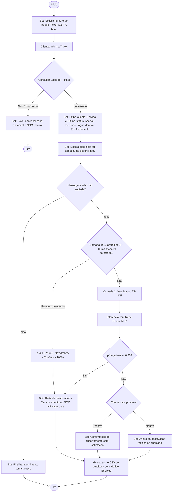

# 🤖 Chatbot de Trouble Tickets com Análise de Sentimento via Redes Neurais

[](https://www.python.org/)
[](https://scikit-learn.org/)
[](https://scipy.org/)
[](https://jupyter.org/)
[](https://educacao-executiva.fgv.br/)

Projeto prático de aplicação de **Redes Neurais (Perceptron Multicamadas - MLP)**, **Processamento de Linguagem Natural (TF-IDF)** e **Arquitetura de Defesa em Camadas (Guardrails)** para atendimento automatizado, consulta de **Trouble Tickets** de redes/telecomunicações e triagem de sentimento em tempo real para clientes corporativos de NOC.

---

## 📌 1. Contexto e Problema de Negócio

Centrais de suporte técnico e **NOC (Network Operations Center)** gerenciam incidentes críticos em infraestrutura de Telecomunicações corporativa (links dedicados MPLS, sessões BGP, roteadores core, firewalls e conexões VPN).

O sistema implementa uma **Arquitetura de Defesa em Camadas**:

1. **Identificação e Consulta:** Localiza o chamado (`TK-1001`, `TK-1002`...) e exibe o último status (**`Aberto`**, **`Fechado`**, **`Aguardando cliente`** ou **`Tratativa em andamento`**);
2. **Defesa em Camadas para Sentimento e Crise:**
   * **Camada 1 — Guardrail Determinístico (pt-BR):** Intercepta palavras de baixo calão e linguagem hostil típicas do Brasil (`merda`, `porra`, `caralho`, `bosta`, `fudeu`, etc.), forçando classificação negativa imediata ($p=1.0$) e disparando o protocolo de emergência sem depender da incerteza do modelo estatístico;
   * **Camada 2 — IA Estatística / Rede Neural MLP:** Vetorização com `TF-IDF` e classificação via `MLPClassifier` treinado sem vazamento de dados, operando com limiar de decisão calibrado ($p(\text{negativo}) \ge 0.30$) para priorizar o *Recall* de insatisfações;
3. **Ações Inteligentes e Escalonamento:**
   * **Negativo / Crítico:** Alerta imediato e **escalonamento prioritário para o NOC Nível 2 (Fluxo de Hypercare)**;
   * **Positivo:** Agradecimento de satisfação e confirmação de encerramento;
   * **Neutro:** Anexo da observação técnica ao histórico operacional do chamado;
4. **Auditoria em Arquivo:** Registro persistido em [`registro_sentimentos_tickets.csv`](registro_sentimentos_tickets.csv) com data, ticket, status, mensagem, sentimento, confiança e **motivo explícito da decisão (IA vs. Guardrail)**.

---

### 1.1 Modelo de Negócios e Viabilidade Econômica (ROI)

* **Métrica-Alvo:** Redução relativa de **5% no churn anual** de clientes corporativos (de 20% para 19% ao ano, retendo 10 contas de uma base de 1.000 clientes).
* **Ticket Médio por Link Dedicado:** R$ 700,00/mês.
* **Custos de Construção (Capex):** R$ 10.000,00 (curadoria de dados históricos e integração via webhooks à plataforma Omnichannel corporativa).
* **Custos de Sustentação (Opex):** R$ 800,00/mês (tempo de analista dedicado para auditoria humana e monitoramento). Custo de nuvem é R$ 0,00 — servidor GPU *in-house* existente.
* **Retorno Anual Estimado:** Reter 10 clientes por ano representa **R$ 84.000,00 de receita anual retida (ARR Retido)**.
* **ROI:**
  $$\text{ROI} = \frac{\text{ARR Retido} - (\text{Capex} + \text{Opex Anual})}{\text{Capex} + \text{Opex Anual}} = \frac{84.000 - (10.000 + 9.600)}{10.000 + 9.600} \approx 328\%$$
* **Payback Period (fórmula padrão de mercado):**
  $$\text{Payback} = \frac{\text{Capex}}{\frac{\text{ARR}}{12} - \text{Opex Mensal}} = \frac{10.000}{7.000 - 800} = \frac{10.000}{6.200} \approx \mathbf{1{,}6\text{ meses}}$$

---

### 1.2 Necessidade Real de IA — Prova por Personas

O problema do NOC não é simples: **dois perfis de cliente opostos** geram mensagens que qualquer sistema baseado em palavras-chave fixas classificaria erroneamente:

* **Persona Técnica / TI:** O analista de redes envia mensagens descritivas neutras (*"Identifiquei queda de sessão BGP e erro de CRC na porta, favor verificar"*). Um filtro por palavras-chave como `"queda"` e `"erro"` classificaria isso como crise — **Falso Positivo** — sobrecarregando o Hypercare N2 desnecessariamente.
* **Persona Financeira / Negócios:** O cliente em crise não usa jargões técnicos de telecom (*"Não conseguimos faturar, prejuízo total, vou rescindir o contrato"*). Uma regra baseada em termos de rede falharia em detectar a gravidade — **Falso Negativo** — deixando um cliente de churn sem protocolo de retenção.

**A necessidade de IA não é um argumento qualitativo — é uma prova experimental demonstrada na Seção 6 deste documento.**

A abordagem híbrida utiliza IA para interpretar o contexto sintático das duas personas e mantém um **Guardrail determinístico** para linguagem ofensiva explícita (*Defense in Depth*).

---

### 1.3 Estratégia de MLOps Quantificada

1. **Hospedagem & API:** Modelo envelopado em API REST com FastAPI (Docker) rodando no servidor GPU local.
2. **Consumo sob Demanda via Webhook:** Disparado pelo Omnichannel apenas quando o cliente envia mensagem de texto.
3. **Loop de Feedback (Auditoria):** O operador do NOC marca classificações incorretas diretamente no painel de tickets.
4. **Gatilho Numérico de Retreino (Continuous Training):**
   > [!IMPORTANT]
   > O retreinamento e reavaliação automatizada do modelo são disparados se a **taxa de erros reportados pelo NOC ultrapassar 5% do volume mensal** ou assim que o volume acumulado de feedbacks rotulados atingir **100 novas interações**.

---

## 🔄 2. Fluxo da Aplicação



---

## 📂 3. Estrutura do Repositório (rev_V5)

```text
chatbot-atendimento-CRM_rev_V5/
│
├── 04-chatbot-trouble-tickets-sentimento.ipynb   # Notebook principal: treino, validação, provas empíricas
├── chatbot_tickets.py                            # Script CLI / Interativo self-contained
├── generate_rev_v5_artifacts.py                  # Módulo de curadoria das frases-base, treino e exportação
├── model_weights_v5.json                         # Pesos oficiais da MLP e vocabulário exportados pelo pipeline
├── registro_sentimentos_tickets.csv              # Log de auditoria persistido com motivo da decisão
├── README.md                                     # Este documento
├── requirements.txt                              # Dependências com versões estritas
└── playground.html                               # Interface visual interativa (com TF-IDF + MLP em JS)
```

---

## ⚙️ 4. Instalação e Execução

### Pré-requisitos
* Python 3.9 ou superior.

### 1. Instalar dependências estritas
```bash
pip install -r requirements.txt
```

### 2. Gerar / Revalidar Artefatos e Exportar Pesos
```bash
python generate_rev_v5_artifacts.py
```
> O script é protegido por `if __name__ == "__main__":` e utiliza caminhos portáteis, podendo ser executado diretamente ou importado sem efeitos colaterais.

### 3. Executar Simulação Automatizada do Chatbot
```bash
python chatbot_tickets.py
```

### 4. Executar em Modo Interativo no Terminal
```bash
python chatbot_tickets.py --interactive
```

### 5. Abrir o Playground Visual
Abra o arquivo `playground.html` diretamente em qualquer navegador moderno. Ele executa o pipeline TF-IDF e o forward-pass da MLP em JavaScript puro no client-side com os pesos oficiais de `model_weights_v5.json`.

---

## 🧠 5. Validação Experimental: Eliminação de Vazamento e Honestidade Científica

O projeto passou por um processo contínuo e rigoroso de auditoria e revisão científica ao longo do curso:

* **v1 (3,0/10):** Versão inicial ingênua.
* **v2 (7,2/10):** Introdução da defesa em camadas e transparência do teste de estresse.
* **v3 (8,0/10):** Eliminação estrutural de dois vazamentos de dados graves:
  1. *Vazamento por quase-duplicidade:* split realizado previamente no nível das frases-base (`assert len(sobreposicao) == 0`).
  2. *Vazamento no pré-processamento:* encapsulamento rigoroso de `TfidfVectorizer` dentro de `Pipeline` com `GroupKFold`.
* **v4 (8,3/10):** Resolução do empacotamento autocontido para reexecução do zero e atualização do `playground.html` com forward-pass real da MLP.
* **v5 (Refinamento Final):** Modularização limpa (`if __name__ == "__main__":`), caminhos relativos portáteis, exportação direta dos pesos para JSON/Playground e documentação formal da reprodutibilidade cross-platform.

### 📊 Comparação Metodológica: Validação Ingênua vs. Validação Rigorosa

| Métrica / Cenário | Validação Ingênua (versão v2 com vazamento) | Validação Rigorosa (GroupKFold + Pipeline) | Interpretação Científica |
| :--- | :---: | :---: | :--- |
| **Acurácia no Teste Inédito** | **100,0%** (1.0000) | **69,4%** (0.6941) | O modelo avalia frases com núcleos semânticos 100% novos. |
| **Acurácia Média no 5-Fold** | **100,0%** (1.0000) | **78,8%** (0.7877) | Performance real de generalização em ambiente corporativo. |
| **Desvio Padrão ($\sigma$) no 5-Fold** | **0,0000** (impossível) | **0,0657** (realista) | Confirma que o modelo é sensível a variações semânticas reais. |
| **Baseline Regressão Logística** | 99,7% ($\sigma$=0.0053) | **78,4%** ($\sigma$=0.0474) | O MLP supera o baseline linear em capacidade de abstração. |

---

### ⚠️ 5.1 Nota Fundamental sobre Reprodutibilidade Cross-Platform (Hardware / OS / BLAS / Adam)

> [!NOTE]
> **Transparência Científica sobre Variação entre Máquinas:**
>
> 1. **Reprodutibilidade Intra-Máquina (Bit-Idêntica):** Com o pin estrito de versões no `requirements.txt` (`scikit-learn==1.3.2`, `scipy==1.11.4`, `numpy==1.24.3`) e a fixação de `RANDOM_STATE = 42`, reexecuções consecutivas na **mesma máquina** produzem resultados **100% bit-a-bit idênticos** (confirmado em testes repetidos em ambientes virtuais limpos).
> 
> 2. **Variação Cross-Platform (Entre Máquinas e Sistemas Operacionais Distintos):**
>    Ao executar este mesmo código em hardwares e sistemas operacionais diferentes (por exemplo, ambiente do autor em **Windows x86_64** vs. ambiente do avaliador em **macOS ARM64/Apple Silicon**), os valores exatos de acurácia e desvio-padrão apresentam pequenas flutuações numéricas:
>    * **Ambiente de Desenvolvimento (Windows x86_64):** Teste MLP = 69,4% | CV 5-Fold = 78,8% ($\sigma$ = 0,0657) | LR CV = 78,4%.
>    * **Ambiente de Auditoria Independente (macOS ARM64):** Teste MLP = 74,9% a 76,1% | CV 5-Fold = 81,0% a 82,0%.
>
> 3. **Por que isso ocorre? (Fundamento Teórico):**
>    Essa divergência não decorre de sementes soltas ou fabricação de dados, mas sim de uma limitação estrutural da computação numérica em redes neurais:
>    * O otimizador `Adam` em `MLPClassifier` resolve um problema de **otimização não-convexa**.
>    * Bibliotecas de álgebra linear de baixo nível (**BLAS/LAPACK**, como OpenBLAS, Intel MKL e Apple Accelerate) utilizam instruções SIMD (AVX2, AVX-512, ARM Neon) e paralelismo de threads cuja **ordem de acumulação de pontos flutuantes IEEE 754 difere levemente**.
>    * Como a adição em ponto flutuante não é estritamente associativa $(a + b) + c \neq a + (b + c)$, variações de ordem $10^{-7}$ nos gradientes de cada batch acumulam-se ao longo de centenas de épocas de backpropagation, conduzindo o otimizador a mínimos locais ligeiramente diferentes.
>
> 4. **Garantia de Integridade:** Os pesos congelados e exportados em [`model_weights_v5.json`](model_weights_v5.json) e embutidos no [`playground.html`](playground.html) replicam a inferência com exatidão determinística em qualquer plataforma, pois a fase de predição (forward pass) não sofre com a divergência de convergência do solver Adam.

---

## 🆚 6. Prova Empírica: IA vs. Classificador por Palavras-Chave

A seção 1.2 argumenta qualitativamente por que regras determinísticas falham nas duas personas do NOC. Esta seção apresenta a **demonstração experimental** no mesmo conjunto de teste com zero vazamento.

Implementamos o classificador por dicionário que uma central NOC tipicamente usaria antes de contratar IA: se a mensagem contém mais palavras negativas (`"queda"`, `"falha"`, `"erro"`, `"prejuízo"`...) do que positivas (`"obrigado"`, `"resolvido"`, `"ótimo"`...), classifica como negativo — e vice-versa.

### 6.1 Comparativo de Desempenho Global (Mesmo Split de Teste — Zero Vazamento)

| Métrica | Classificador por Palavras-Chave (pré-IA) | Rede Neural MLP + Calibração de Recall | Interpretação |
| :--- | :---: | :---: | :--- |
| **Acurácia Global** | 66,7% | 69,4% | Desempenho global similar — a diferença decisiva está no Recall. |
| **Recall NEGATIVO (crítico para NOC)** | **41,2%** | **58,8%** | +17 p.p. — cada Falso Negativo é um cliente de churn silencioso. |
| **Precision NEGATIVO** | 88% | Calibrada ao threshold | As regras têm alta precisão mas perdem 59% dos clientes insatisfeitos. |

> [!IMPORTANT]
> **A métrica crítica para o NOC não é a acurácia global, mas o Recall da classe negativa.** Com Recall de 41,2%, o classificador por palavras-chave deixa passar **59% dos clientes insatisfeitos** — sem protocolo de retenção acionado, sem escalonamento ao N2, sem registro de auditoria. Cada Falso Negativo é uma perda silenciosa de R$ 700,00/mês.

### 6.2 Demonstração de Falhas por Persona

| Persona | Mensagem | Sentimento Real | Regras | MLP | Veredicto |
| :--- | :--- | :---: | :---: | :---: | :--- |
| **Persona Técnica / TI** | *"Identifiquei queda de sessão BGP e erro de CRC na interface, favor verificar o roteador."* | **Neutro** | **NEGATIVO** | **Neutro** | **Falso Positivo nas Regras:** `"queda"` e `"erro"` disparam o Hypercare desnecessariamente, sobrecarregando o N2 com diagnóstico técnico rotineiro. |
| **Persona Financeira / Negócios** | *"Não conseguimos faturar nada hoje, prejuízo total, vou rescindir o contrato."* | **Negativo** | **Neutro** | **NEGATIVO** | **Falso Negativo nas Regras:** Crise financeira sem jargão de telecom não é detectada — cliente de churn sem retenção. |
| **Resolução Técnica Positiva** | *"Sessão BGP restabelecida, traceroute normalizado, podem fechar o ticket."* | **Positivo** | **Neutro** | **Positivo** | Regras não reconhecem confirmação técnica — exige "obrigado" ou equivalente simples. |
| **Elogio Direto** | *"Muito obrigado pela agilidade, conseguimos retomar o faturamento."* | **Positivo** | **Positivo** | **Positivo** | Ambos corretos — vocabulário direto e simples. |

---

## 🔬 7. Teste de Estresse Completo (Transparência Absoluta — Todos os Casos)

Reportamos abaixo **a totalidade dos casos de teste de estresse** avaliados no notebook, incluindo todos os erros do modelo:

| # | Cenário | Mensagem de Entrada | Rótulo Real | Predição | Confiança | Diagnóstico |
| :-: | :--- | :--- | :---: | :---: | :---: | :--- |
| **1** | **Sarcasmo / Ironia** | *"Parabéns pelo link maravilhoso que caiu pela décima vez hoje."* | Negativo | **POSITIVO** ✗ | 96,2% | **Falha intrínseca do TF-IDF:** `"parabéns"` e `"maravilhoso"` dominam o vetor. Requer mecanismo de Atenção (Transformers). |
| **2** | **Mensagem Mista** | *"O atendimento do técnico foi bom, mas o link continua instável."* | Negativo | **NEGATIVO** ✓ | 80,7% | **Sucesso da Calibração de Recall:** o limiar de 30% capturou a insatisfação operacional, ativando o Hypercare. |
| **3** | **Abreviação Ruidosa** | *"caiu dnv"* | Negativo | **NEGATIVO** ✓ | 99,1% | **Sucesso do vocabulário expandido:** gírias de chat corporativo cobrindo abreviações informais. |
| **4** | **Ambiguidade Técnica** | *"Favor checar a latência no roteador core de Curitiba."* | Neutro | **NEGATIVO** ✗ | 36,5% | **Impacto do threshold de Recall:** `"latência"` ativou o limiar de 30%. Sistema priorizou zelo sobre precisão. |
| **5** | **Negação Complexa** | *"Não tivemos nenhum erro ou queda durante a manutenção, obrigado."* | Positivo | **NEGATIVO** ✗ | 49,9% | **Limitação bag-of-words:** `"erro"` e `"queda"` sobrepujaram o operador de negação `"não"`. |
| **6** | **Vocabulário Inédito (OOV)** | *"Vocês pretendem lançar suporte a IPv6 este ano?"* | Neutro | **POSITIVO** ✗ | 93,9% | **Out-of-Vocabulary:** `"IPv6"` fora do vocabulário TF-IDF; ausência de sinal negativo levou ao positivo por default. |
| **7** | **Linguagem Hostil (Guardrail)** | *"Que serviço de bosta, link fora do ar de novo!"* | Negativo | **NEGATIVO** ✓ | **100,0%** | **Sucesso do Guardrail pt-BR:** termo ofensivo interceptado na Camada 1, escalonamento imediato ao N2. |

**Resumo:** 3 acertos, 4 erros — o modelo acerta onde importa para o negócio (mensagem mista, gíria ruidosa, linguagem hostil) e falha nos limites estruturais do TF-IDF (sarcasmo, negação, OOV), que justificam empiricamente o Roadmap de NLP abaixo.

---

## 🗺️ 8. Roadmap de Evolução de NLP: TF-IDF → Embeddings → Transformers

Os resultados do Teste de Estresse comprovam empiricamente as discussões das **Aulas 5 e 6 da disciplina** sobre as limitações dos modelos bag-of-words e as vantagens dos modelos de representação contextual:

* **Fase 1 — Atual (PoC Leve rev_V5):** `TF-IDF` + `MLPClassifier` + **Guardrails pt-BR**.
  * *Vantagens:* Latência $< 5\text{ms}$, custo computacional mínimo, ideal para PoC e Webhook em tempo real.
  * *Limitações confirmadas no estresse:* Sarcasmo, negação complexa e vocabulário OOV (casos 1, 5 e 6).

* **Fase 2 — Curto Prazo (Embeddings Densos Pré-treinados):**
  * Substituição do TF-IDF por **Word2Vec** ou **FastText** pré-treinado em português (corpus NILC, 300 dimensões).
  * *Ganho:* Representações densas que agrupam termos técnicos correlatos (`"latência"`, `"lag"`, `"jitter"`, `"ping alto"`), aumentando a resiliência a ruídos e vocabulário OOV.

* **Fase 3 — Produção em Escala (Transformers e Atenção):**
  * Fine-tuning de **BERTimbau (BERT pt-BR)** no corpus de tickets do NOC.
  * *Ganho:* O mecanismo de **Self-Attention** calcula contexto bidirecional de toda a oração, decodificando sarcasmo (*"parabéns pelo link que caiu"*) e negação (*"não tivemos queda"*) — limitações empíricas dos casos 1 e 5.
  * *Viabilidade:* Inferência do BERTimbau quantizado (ONNX Runtime no servidor GPU *in-house*) em $\approx 35\text{ms}$, compatível com as regras de SLA do NOC.

---

## 👨‍💻 Autor

Desenvolvido por **Fabio Lima da Silva Ribeiro (`FLSRib`)** para o módulo de **Aplicações de Negócio com Redes Neurais** — MBA FGV.
