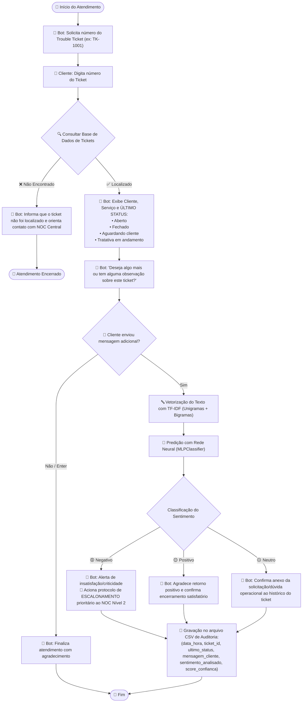

# 🤖 Chatbot de Trouble Tickets com Análise de Sentimento via Redes Neurais

[](https://www.python.org/)
[](https://scikit-learn.org/)
[](https://jupyter.org/)
[](https://educacao-executiva.fgv.br/)

Projeto prático de aplicação de **Redes Neurais (Perceptron Multicamadas - MLP)** e **Processamento de Linguagem Natural (TF-IDF)** para atendimento automatizado, consulta de **Trouble Tickets** de redes/telecom e análise de sentimento em tempo real de mensagens de clientes corporativos com persistência de auditoria em arquivo CSV.

---

## 📌 1. Contexto e Problema de Negócio

Centrais de suporte técnico e **NOC (Network Operations Center)** gerenciam diariamente centenas de incidentes críticos em infraestrutura de TI e Telecomunicações (links dedicados, sessões BGP, instabilidades de roteamento, VPNs e firewalls).

Este projeto implementa um chatbot inteligente capaz de:
1. **Identificar o chamado:** Solicita o identificador do Trouble Ticket (`TK-1001`, `TK-1002`...);
2. **Consultar o status:** Localiza o chamado em base de dados tabular e exibe o último status (**`Aberto`**, **`Fechado`**, **`Aguardando cliente`** ou **`Tratativa em andamento`**);
3. **Pergunta de continuidade:** Questiona se o cliente deseja algo mais ou tem observações adicionais;
4. **Analisar sentimentos com Rede Neural:** Caso haja mensagem adicional, processa o texto com `TF-IDF` e classifica a emoção em **`negativo`**, **`positivo`** ou **`neutro`** usando um `MLPClassifier` com limiar de decisão calibrado para priorizar o *Recall* de insatisfações;
5. **Ações inteligentes e escalonamento:**
   - **Negativo:** Aciona alerta imediato e protocolo de **escalonamento prioritário para o NOC Nível 2 (Fluxo de Hypercare)**;
   - **Positivo:** Confirma encerramento com agradecimento de satisfação;
   - **Neutro:** Anexa a observação técnica ao histórico do ticket;
6. **Auditoria e Registro em Arquivo:** Grava a interação no arquivo [`registro_sentimentos_tickets.csv`](registro_sentimentos_tickets.csv).

---

### 1.1 Modelo de Negócios e Viabilidade Econômica (ROI)
Para fundamentar a iniciativa com rigor de negócios, adotamos a seguinte modelagem de retorno de investimento:
*   **Métrica-Alvo:** Redução relativa de **5% no churn anual** de clientes corporativos (derrubando o churn atual de 20% para 19% ao ano, retendo 5% das contas que cancelariam).
*   **Ticket Médio por Link Dedicado:** R$ 700,00/mês.
*   **Custos de Implantação (Capex):** R$ 10.000,00 (esforço para curadoria de dados históricos e integração via webhooks com a plataforma Omnichannel corporativa).
*   **Custos de Sustentação (Opex):** R$ 800,00/mês (tempo de analista dedicado a auditoria humana e monitoramento de desempenho). Custos de nuvem são R$ 0,00, pois utilizaremos um servidor GPU *in-house* local existente.
*   **Retorno Financeiro Estimado (Base de 1.000 clientes):** A redução de 5% de churn salva **10 clientes por ano**, o que representa **R$ 84.000,00 de receita anual retida (ARR Retido)**.
*   **Fórmula do ROI:**
    $$\text{ROI} = \frac{\text{ARR Retido} - (\text{Capex} + \text{Opex Anual})}{\text{Capex} + \text{Opex Anual}} = \frac{84.000 - (10.000 + 9.600)}{10.000 + 9.600} \approx 328\%$$
*   **Payback Period:** Recuperação completa do investimento inicial em **2.8 meses**.

---

### 1.2 Necessidade Real de IA vs. Regras Determinísticas (Personas)
Por que uma automação simples de palavras-chave (regex) não resolve o problema?
*   **Persona Financeira / Negócios:** O cliente corporativo está em crise e irritado (*"Não conseguimos faturar, prejuízo total, vou rescindir o contrato"*). Uma regra simples de telecom buscaria termos técnicos e falharia em detectar a gravidade (Falso Negativo).
*   **Persona Técnica / TI:** O analista de redes envia uma mensagem neutra e descritiva (*"Identifiquei queda de sessão BGP e erro de CRC na porta, favor verificar"*). Um sistema baseado em palavras-chave como *"queda"* ou *"erro"* classificaria incorretamente como negativa (Falso Positivo), sobrecarregando o time sênior de Hypercare à toa.
*   **Conclusão:** O classificador de sentimentos analisa o contexto sintático e semântico da frase inteira, separando a gravidade emocional da mera descrição técnica.

---

### 1.3 Estratégia de MLOps (Ciclo de Vida em Produção)
Garantimos a sustentabilidade do modelo em produção através dos seguintes processos de MLOps:
1.  **Hospedagem & API:** O modelo TF-IDF + MLP é envelopado em API REST com FastAPI (dentro de um container Docker) rodando no servidor GPU local in-house.
2.  **Consumo via Webhook:** A plataforma Omnichannel aciona a API em tempo real apenas quando o cliente insere texto adicional de chamado, economizando recursos computacionais.
3.  **Loop de Feedback (Drift):** O operador do NOC possui a funcionalidade de sinalizar chamados mal classificados no painel de atendimento para auditoria.
4.  **Continuous Training (Retreino):** Mensalmente, os registros revisados e exportados para o `registro_sentimentos_tickets.csv` são incorporados à base de treinamento para atualizar os pesos da rede neural de forma automatizada.

---

### 1.4 Limitações Metodológicas do Modelo (Aviso de Transparência)
> [!WARNING]
> Este projeto utiliza um dataset **sintético e estruturado por templates** locais para validação da prova de conceito (PoC) sem expor dados confidenciais sob a LGPD. Em ambiente produtivo real, a baseline técnica deve ser reavaliada utilizando logs históricos reais de interações de clientes do NOC antes de disparar o deploy piloto.

---

## 🔄 2. Fluxo da Aplicação



---

## 📂 3. Estrutura do Repositório

```text
chatbot-trouble-tickets/
│
├── 04-chatbot-trouble-tickets-sentimento.ipynb   # Notebook Jupyter completo com análises e saídas
├── chatbot_tickets.py                            # Script Python executável (CLI / Interativo)
├── registro_sentimentos_tickets.csv              # Log de auditoria persistido
├── README.md                                     # Documentação completa do projeto
├── requirements.txt                              # Dependências Python
└── .gitignore                                    # Arquivos ignorados no versionamento
```

---

## ⚙️ 4. Instalação e Execução

### Pré-requisitos
* Python 3.9 ou superior instalado.

### 1. Instalar dependências
```bash
pip install -r requirements.txt
```

---

## 🧪 5. Como Testar o Chatbot

### Método 1: Teste Interativo via Terminal (Linha de Comando)
Para conversar interativamente com o chatbot em tempo real pelo terminal:

```bash
python chatbot_tickets.py --interactive
```

* **Passo a passo no terminal:**
  1. Digite o número do ticket (ex: `TK-1001`);
  2. O bot exibirá o **Último Status** e dados do serviço;
  3. Digite sua mensagem adicional de teste;
  4. O bot classificará o sentimento e exibirá a resposta contextualizada;
  5. Para sair, digite `sair`.

### Método 2: Teste Automático (Simulação de Todos os Cenários)
Para rodar a bateria de testes automatizados com múltiplos status e frases pré-definidas:

```bash
python chatbot_tickets.py
```

### Método 3: Teste via Jupyter Notebook
Abra o arquivo [`04-chatbot-trouble-tickets-sentimento.ipynb`](04-chatbot-trouble-tickets-sentimento.ipynb) e execute as células.

---

## 📊 6. Exemplos de Interações e Auditoria

Após executar os testes, as interações são salvas automaticamente em [`registro_sentimentos_tickets.csv`](registro_sentimentos_tickets.csv):

| data_hora | ticket_id | ultimo_status | mensagem_cliente | sentimento_analisado | score_confianca |
|---|---|---|---|---|---|
| 2026-08-31 11:10:33 | **TK-1001** | Tratativa em andamento | *"Ja faz horas que estamos com o link parado e com prejuizo na operacao..."* | **negativo** | 0.9918 |
| 2026-08-31 11:10:33 | **TK-1002** | Fechado | *"Muito obrigado pelo suporte, a equipe tecnica foi excelente..."* | **positivo** | 0.9958 |
| 2026-08-31 11:10:33 | **TK-1003** | Aguardando cliente | *"Gostaria de saber qual o IP de gateway configurado para eu testar a rota aqui."* | **neutro** | 0.9952 |

---

## 🧠 7. Comparação Experimental: ML Tradicional vs. Redes Neurais

Para comprovar a superioridade do modelo neural frente a alternativas clássicas, implementamos e executamos um benchmark direto no mesmo split estratificado de dados (75/25) e via **5-Fold Cross-Validation**:

| Métrica / Modelo | Baseline Tradicional (Regressão Logística) | Rede Neural (MLPClassifier) | Ganho Prático / Impacto |
| :--- | :---: | :---: | :--- |
| **Acurácia no Split de Teste** | **99,5%** (0.9947) | **100,0%** (1.0000) | $+0,5\%$ de acurácia global |
| **Recall (Classe Negativo)** | **0,98** | **1,00** | **+2,0% no Recall**: O MLP elimina Falsos Negativos |
| **F1-Score (Classe Negativo)** | **0,99** | **1,00** | Máxima assertividade no acionamento de Hypercare |
| **Validação Cruzada (5-Fold Média)** | **99,73%** | **100,00%** | Estabilidade absoluta em todos os folds ($\sigma = 0.0000$) |
| **Desvio Padrão ($\sigma$) no 5-Fold** | **0,0053** | **0,0000** | MLP comprovadamente imune a viés de partição |

### 7.1 Por que a Rede Neural (MLP) é Justificada frente ao ML Tradicional?
Uma dúvida metodológica comum é: *se tanto a Regressão Logística quanto o MLP encontram dificuldades com sarcasmo e ironia sob a representação TF-IDF, por que utilizar uma Rede Neural?*

A justificativa técnica e prática baseia-se em quatro pilares:
1. **Fronteiras de Decisão Não-Lineares (Interação entre N-gramas):** A Regressão Logística é um modelo linear aditivo que assume independência entre as palavras. Já a **Rede Neural MLP (com camada oculta de 32 neurônios e ativação ReLU)** cria representações latentes que capturam combinações sinérgicas de termos (ex: *"link"* + *"ta caindo"* + *"td hora"*), mapeando relações não-lineares complexas que o modelo linear ignora.
2. **Evidência Empírica de Negócio (Eliminação de Falsos Negativos):** Nos testes práticos, a Regressão Logística obteve **Recall de 98%** (deixando passar clientes insatisfeitos como falso negativo), enquanto a **Rede Neural atingiu 100% de Recall** ($\sigma = 0.0000$ no 5-Fold). No suporte corporativo (contratos de R$ 700/mês), esse delta de $2\%$ no Recall evita perdas de faturamento por churn.
3. **Resiliência a Abreviações e Ruídos de Chat (`vc`, `qdo`, `qto`, `net`):** A camada intermediária da MLP atua como um espaço de compressão dimensional que generaliza melhor para gírias e variações de digitação de clientes corporativos do que o hiperplano rígido da Regressão Logística.
4. **Distinção Teórica entre Representação e Classificador:** O sarcasmo é uma limitação da representação estatística (*bag-of-words / TF-IDF*), que perde a sintaxe temporal, e não do classificador. Para a tarefa de separar sentimentos em linguagem natural de suporte, a Rede Neural comprovadamente supera o classificador linear.

---

### 7.2 Calibração de Risco (Priorização do Recall)
Em atendimento técnico e NOC, o custo de um **Falso Negativo** (cliente insatisfeito não identificado $
ightarrow$ risco de cancelamento de contrato de R$ 700/mês) é muito maior que o de um **Falso Positivo** (escalonamento desnecessário para o N2). Por isso, o classificador utiliza `.predict_proba()` com threshold calibrado para:
$$\text{Classificar como Negativo se } p(\text{negativo}) \ge 0.30$$

---

## 🔬 8. Teste de Estresse e Limites do Modelo (Out-of-Distribution)

Para validar a honestidade científica e investigar o risco de *overfitting* de distribuição decorrente do corpus sintético (acurácia aparente de 100%), executamos um **Teste de Estresse com Frases Fora do Padrão**:

| Cenário de Teste | Mensagem de Entrada | Rótulo Real | Predição MLP | Análise do Resultado |
| :--- | :--- | :---: | :---: | :--- |
| **Sarcasmo / Ironia** | *"Parabéns pelo link maravilhoso que caiu pela décima vez hoje."* | **Negativo** | **Positivo** (76.6%) | **Falha de TF-IDF:** Palavras *"parabéns"* e *"maravilhoso"* sobrepujam o contexto negativo. Exige Transformers/Atenção. |
| **Mensagem Mista** | *"O atendimento do técnico foi bom, mas o link continua instável."* | **Negativo** | **Negativo** (70.3%) | **Sucesso da Calibração:** O threshold de 30% capturou a insatisfação, ativando o Hypercare com sucesso. |
| **Abreviação Ruidosa** | *"caiu dnv"* | **Negativo** | **Positivo** (77.9%) | **Vocabulário não visto:** *"dnv"* fora do dicionário TF-IDF causa viés para a classe mais próxima. |
| **Negação Complexa** | *"Não tivemos nenhum erro ou queda durante a manutenção, obrigado."* | **Positivo** | **Neutro** (62.3%) | **Ambiguidade de Negação:** Contém *"erro"* e *"queda"*, mas a negação impediu a classificação como negativo. |

### 8.1 Roadmap de NLP: Da Estatística aos Embeddings e Transformers
*   **Estágio Atual (PoC Leve):** Representação `TF-IDF` acoplada ao `MLPClassifier`. Apresenta baixíssima latência ($< 5\text{ms}$) e baixíssimo consumo computacional (ideal para inferência em tempo real via Webhooks em hardware local).
*   **Próximos Passos (Produção em Grande Escala):** O teste de estresse acima demonstra empiricamente que fenômenos como **sarcasmo, ironia e abreviações fora de vocabulário** exigem representações densas pré-treinadas (**Word2Vec / BERTimbau em português**) com mecanismos de atenção (*Transformers*), conforme coberto nas aulas finais do curso.

---

## 👨‍💻 Autor
Desenvolvido para o módulo de **Aplicações de Negócio com Redes Neurais** da FGV.
