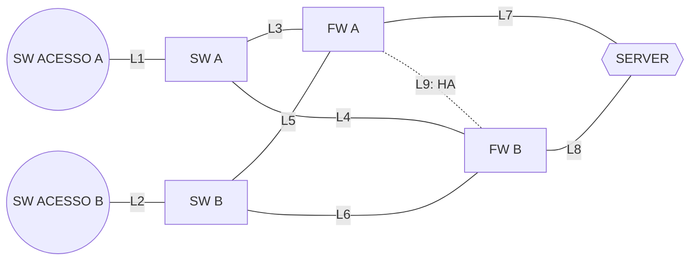

# Topologia redundante e cenários de teste de falha

## 1. Objetivo

Este documento registra a topologia lógica apresentada, identifica os enlaces de `L1` a `L9` e consolida os cenários de teste solicitados:

- falhas simples de nós;
- falhas simples de enlaces;
- falhas duplas de nós.

## 2. Premissas e escopo

- Os nós **SW ACESSO A** e **SW ACESSO B** fazem parte do grafo, mas suas falhas não entram no escopo dos testes.
- Os enlaces `L1` e `L2` permanecem sujeitos a falha.
- Uma falha de nó implica indisponibilidade dos enlaces diretamente conectados ao nó, sem contabilizar esses enlaces como falhas adicionais.
- Falhas duplas de enlaces, combinações de nó com enlace e falhas triplas não fazem parte deste escopo.
- `L1` a `L8` representam enlaces físicos.
- `L9` representa a relação lógica de alta disponibilidade entre os firewalls.

## 3. Grafo da topologia

## 4. Nós do grafo

### 4.1 Nós sujeitos a falha

- `SW A`
- `SW B`
- `FW A`
- `FW B`
- `SERVER`

### 4.2 Nós fora do escopo de falha

- `SW ACESSO A`
- `SW ACESSO B`

## 5. Lista de enlaces

| Enlace | Origem | Destino | Tipo |
|---|---|---|---|
| `L1` | SW ACESSO A | SW A | Físico |
| `L2` | SW ACESSO B | SW B | Físico |
| `L3` | SW A | FW A | Físico |
| `L4` | SW A | FW B | Físico |
| `L5` | SW B | FW A | Físico |
| `L6` | SW B | FW B | Físico |
| `L7` | FW A | SERVER | Físico |
| `L8` | FW B | SERVER | Físico |
| `L9` | FW A | FW B | Lógico, HA |

## 6. Cenários de teste

### 6.1 Falhas simples de nós

- [ ] **SN01** — Falha do nó `SW A`
- [ ] **SN02** — Falha do nó `SW B`
- [ ] **SN03** — Falha do nó `FW A`
- [ ] **SN04** — Falha do nó `FW B`
- [ ] **SN05** — Falha do nó `SERVER`

**Subtotal: 5 cenários.**

> Em cada teste de falha de nó, os enlaces diretamente conectados ao nó são considerados indisponíveis de forma implícita.

### 6.2 Falhas simples de enlaces

- [ ] **SL01** — Falha de `L1`: SW ACESSO A ↔ SW A
- [ ] **SL02** — Falha de `L2`: SW ACESSO B ↔ SW B
- [ ] **SL03** — Falha de `L3`: SW A ↔ FW A
- [ ] **SL04** — Falha de `L4`: SW A ↔ FW B
- [ ] **SL05** — Falha de `L5`: SW B ↔ FW A
- [ ] **SL06** — Falha de `L6`: SW B ↔ FW B
- [ ] **SL07** — Falha de `L7`: FW A ↔ SERVER
- [ ] **SL08** — Falha de `L8`: FW B ↔ SERVER
- [ ] **SL09** — Falha de `L9`: relação de HA entre FW A e FW B

**Subtotal: 9 cenários.**

### 6.3 Falhas duplas de nós

- [ ] **DN01** — Falha simultânea de `SW A` + `SW B`
- [ ] **DN02** — Falha simultânea de `SW A` + `FW A`
- [ ] **DN03** — Falha simultânea de `SW A` + `FW B`
- [ ] **DN04** — Falha simultânea de `SW A` + `SERVER`
- [ ] **DN05** — Falha simultânea de `SW B` + `FW A`
- [ ] **DN06** — Falha simultânea de `SW B` + `FW B`
- [ ] **DN07** — Falha simultânea de `SW B` + `SERVER`
- [ ] **DN08** — Falha simultânea de `FW A` + `FW B`
- [ ] **DN09** — Falha simultânea de `FW A` + `SERVER`
- [ ] **DN10** — Falha simultânea de `FW B` + `SERVER`

**Subtotal: 10 cenários.**

## 7. Resumo do plano de testes

| Grupo de testes | Quantidade |
|---|---:|
| Falhas simples de nós | 5 |
| Falhas simples de enlaces | 9 |
| Falhas duplas de nós | 10 |
| **Total** | **24** |

## 8. Registro de execução

| ID | Data | Executor | Resultado | Evidência/observação |
|---|---|---|---|---|
|  |  |  |  |  |
|  |  |  |  |  |
|  |  |  |  |  |
